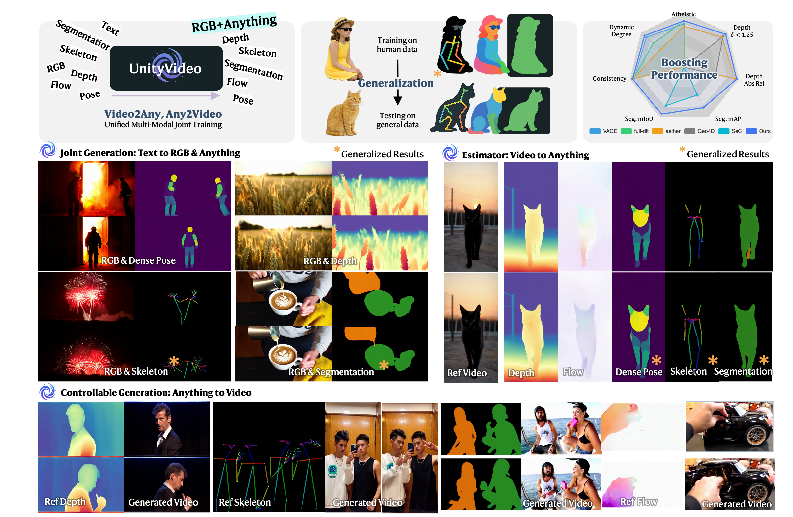
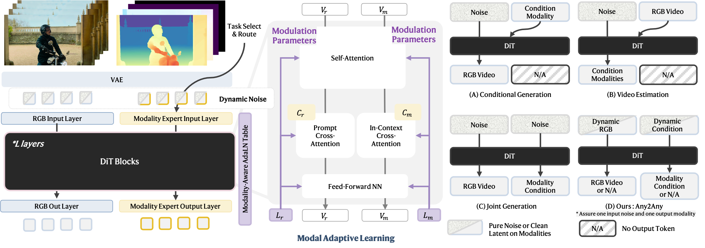

<div align="center">


# UnityVideo : Unified Multi-Modal Multi-Task Learning for Enhancing World-Aware Video Generation

[](https://arxiv.org/abs/2512.07831)
[](https://jackailab.github.io/Projects/UnityVideo)
[](LICENSE)
[](https://huggingface.co/JackAILab/UnityVideo)
[](https://huggingface.co/datasets/JackAILab/OpenUni)

**[Jiehui Huang](https://github.com/)**<sup>1</sup> · 
[Yuechen Zhang](https://github.com/)<sup>2</sup> · 
[Xu He](https://github.com/)<sup>3</sup> · 
[Yuan Gao](https://github.com/)<sup>4</sup> · 
[Zhi Cen](https://github.com/)<sup>4</sup> · 
[Bin Xia](https://github.com/)<sup>2</sup> · <br>
[Yan Zhou](https://github.com/)<sup>4</sup> · 
[Xin Tao](https://github.com/)<sup>4</sup> · 
[Pengfei Wan](https://github.com/)<sup>4</sup> · 
**[Jiaya Jia](https://jiaya.me/)**<sup>1,✉</sup>

<sup>1</sup>HKUST · <sup>2</sup>CUHK · <sup>3</sup>Tsinghua University · <sup>4</sup>Kling Team, Kuaishou Technology

<sup>✉</sup>Corresponding Author

---

### 📢 Code will be released soon! Stay tuned! 🚀

</div>

---

## 📖 Introduction

<div align="center">
  
</div>

**UnityVideo** is a unified generalist framework for multi-task multi-modal video understanding that enables:

- 🎨 **Text-to-Video Generation**: Create high-quality videos from text descriptions
- 🎮 **Controllable Generation**: Fine-grained control over video generation with various modalities
- 🔍 **Modality Estimation**: Estimate depth, normal, and other modalities from video
- 🌟 **Zero-Shot Generalization**: Strong generalization to novel objects and styles without additional training

Our unified architecture achieves state-of-the-art performance across multiple video generation benchmarks while maintaining efficiency and scalability.

---

## 🔥 Highlights

- ✅ **Unified Framework**: Single model handles multiple video understanding tasks
- ✅ **Multi-Modal Support**: Seamlessly processes text, image, and video inputs
- ✅ **World-Aware Generation**: Enhanced physical understanding and consistency
- ✅ **Flexible Control**: Support for various control signals (depth, edge, pose, etc.)
- ✅ **High Quality**: State-of-the-art visual quality and temporal consistency
- ✅ **Efficient Training**: Joint multi-task learning improves data efficiency

---

## 🎯 Method

<div align="center">
  
</div>

UnityVideo employs a unified multi-modal multi-task learning framework that consists of:

1. **Multi-Modal Encoder**: Processes diverse input modalities (text, image, video)
2. **Unified Transformer Backbone**: Shared representation learning across tasks
3. **Task-Specific Heads**: Specialized decoders for different generation and estimation tasks
4. **Joint Training Strategy**: Simultaneous optimization across all tasks

This architecture enables knowledge sharing and improves generalization across different video understanding tasks.

---

## 📊 Results Gallery

### 🎬 Text-to-Video Generation

<table>
  <tr>
    <td align="center" colspan="2"><b>More examples coming Soon</b></td>
  </tr>
</table>

### 🎮 Controllable Generation

<table>
  <tr>
    <td align="center" colspan="2"><b>More examples coming Soon</b></td>
  </tr>
</table>

### 🔍 Modality Estimation

<table>
  <tr>
    <td align="center" colspan="2"><b>More examples coming Soon</b></td>
  </tr>
</table>

---

## 🗓️ TODO List

- [ ] Release training code
- [ ] Release inference code
- [ ] Release pretrained models
- [ ] Release evaluation scripts
- [ ] Release data
- [ ] Add Gradio demo
- [ ] Add Colab notebook
- [ ] Add more usage examples
- [x] Release arXiv paper

---

## ⚖️ License

This repository is released under the **Apache-2.0 license** as found in the [LICENSE](LICENSE) file.


<!-- ## 🌟 Star History

[](https://star-history.com/#YOUR_USERNAME/UnityVideo&Date)

---

<div align="center"> -->

### 🚀 Stay Tuned for Updates!

**Follow this project** to get notified when we release the code!

<!-- [⭐ Star](https://github.com/YOUR_USERNAME/UnityVideo) · [🔔 Watch](https://github.com/YOUR_USERNAME/UnityVideo/subscription) · [🍴 Fork](https://github.com/YOUR_USERNAME/UnityVideo/fork) -->

</div>


---

## 📚 Citation

If you find this work useful for your research, please cite:

```bibtex
@article{huang2024unityvideo,
  title={UnityVideo: Unified Multi-Modal Multi-Task Learning for Enhancing World-Aware Video Generation},
  author={Huang, Jiehui and Zhang, Yuechen and He, Xu and Gao, Yuan and Cen, Zhi and Xia, Bin and Zhou, Yan and Tao, Xin and Wan, Pengfei and Jia, Jiaya},
  journal={arXiv preprint arXiv:2512.07831},
  year={2024}
}
```

---