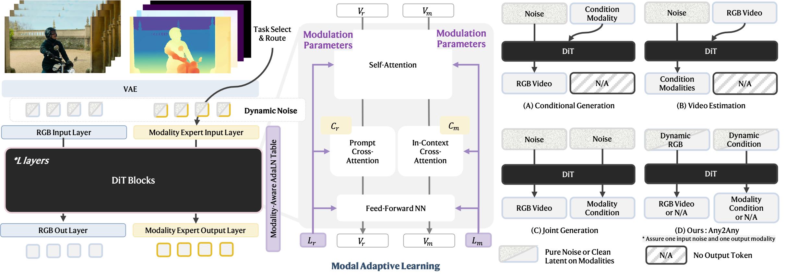
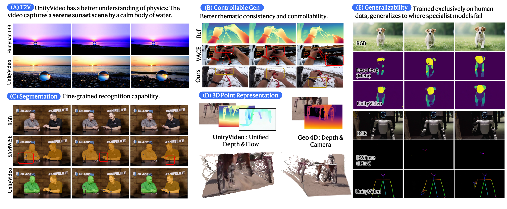

<div align="center">


# UnityVideo

### Unified Multi-Modal Multi-Task Learning for Enhancing World-Aware Video Generation

[](https://arxiv.org/abs/2512.07831)
[](https://jackailab.github.io/Projects/UnityVideo)
[](https://huggingface.co/KlingTeam/UnityVideo)
[](https://huggingface.co/datasets/JackAILab/OpenUni)
[](LICENSE)

**Jiehui Huang**<sup>1</sup>, Yuechen Zhang<sup>2</sup>, Xu He<sup>3</sup>, Yuan Gao<sup>4</sup>,
Zhi Cen<sup>4</sup>, Bin Xia<sup>2</sup>, Yan Zhou<sup>4</sup>, Xin Tao<sup>4</sup>,
Pengfei Wan<sup>4</sup>, **Jiaya Jia**<sup>1</sup>

<sup>1</sup>HKUST, <sup>2</sup>CUHK, <sup>3</sup>Tsinghua University,
<sup>4</sup>Kling Team, Kuaishou Technology

</div>

## Overview

UnityVideo extends Wan2.2 with a joint RGB and auxiliary-modality stream. The two
streams share self-attention, use separate text contexts in cross-attention, and
have separate output heads. One model supports five modalities and three tasks:

| Type | Supported values |
| --- | --- |
| Modalities | depth, DensePose, optical flow (RAFT), segmentation, skeleton |
| Tasks | text-to-RGB+modality, video-to-modality, modality-to-video |

<div align="center">
  
</div>

This release contains the Wan2.2-TI2V-5B implementation used for the public
checkpoint. The historical Wan2.2-T2V-A14B experiments used a different,
RGB+depth-only dual-expert recipe and are not interchangeable with this
five-modality checkpoint.

## Checkpoints

Weights are hosted at [KlingTeam/UnityVideo](https://huggingface.co/KlingTeam/UnityVideo).

| File | Use | Training step |
| --- | --- | ---: |
| `checkpoints/unityvideo_wan22_ti2v_5b_step15000_ema.safetensors` | Recommended for inference | 15,000 |
| `checkpoints/unityvideo_wan22_ti2v_5b_step15000.safetensors` | Resume fine-tuning | 15,000 |

Both files contain the full two-stream DiT. The Wan2.2 VAE and UMT5 text encoder
are loaded from the original
[Wan-AI/Wan2.2-TI2V-5B](https://huggingface.co/Wan-AI/Wan2.2-TI2V-5B) repository.

## Installation

Python 3.10 or newer and a CUDA-enabled PyTorch installation are required.

```bash
git clone https://github.com/JIA-Lab-research/UnityVideo.git
cd UnityVideo
pip install -e .
```

The inference CLI downloads the UnityVideo checkpoint and Wan2.2 base model on
first use. To download them explicitly:

```bash
huggingface-cli download Wan-AI/Wan2.2-TI2V-5B \
  --local-dir models/Wan2.2-TI2V-5B
huggingface-cli download KlingTeam/UnityVideo \
  checkpoints/unityvideo_wan22_ti2v_5b_step15000_ema.safetensors \
  --local-dir models/UnityVideo
```

## Inference

The default examples generate 33 frames at 256 x 256. Increase the resolution
and frame count only after validating the installation at the default settings.

### Video to modality

```bash
unityvideo-infer \
  --task video2flow \
  --modality depth \
  --rgb-video examples/input.mp4 \
  --output outputs/depth.mp4
```

Replace `depth` with `densepose`, `raft`, `segmentation`, or `skeleton` to select
another modality.

### Modality to video

```bash
unityvideo-infer \
  --task flow2video \
  --modality depth \
  --condition-video examples/depth.mp4 \
  --prompt "A person walks through a room." \
  --output outputs/rgb.mp4
```

### Joint text generation

```bash
unityvideo-infer \
  --task text2all \
  --modality depth \
  --prompt "A cyclist rides along a coastal road at sunrise." \
  --output outputs/rgb.mp4 \
  --condition-output outputs/depth.mp4
```

Use `--model-root` and `--checkpoint` to select local files. The equivalent
environment variable for the base model is `WAN22_TI2V5B_DIR`.

## Training

### Data format

Training metadata is a UTF-8 CSV. Paths may be absolute or relative to the CSV.
Each file must contain `video`, `prompt`, and the selected modality column:

```csv
video,prompt,depth
clips/000001.mp4,A person walks through a room.,depth/000001.mp4
```

A combined five-modality example is provided at
[`examples/metadata.csv`](examples/metadata.csv). RGB and modality videos must be
temporally aligned.

### Single node

The released recipe uses five modalities with sampling weights
`0.2,0.2,0.2,0.4,0.4` and task weights `0.5,0.25,0.25` for
`text2all,video2flow,flow2video`.

```bash
export WAN22_TI2V5B_DIR="$PWD/models/Wan2.2-TI2V-5B"
export OUTPUT_DIR="$PWD/outputs/train"
export METADATA_DEPTH="$PWD/data/depth.csv"
export METADATA_DENSEPOSE="$PWD/data/densepose.csv"
export METADATA_RAFT="$PWD/data/raft.csv"
export METADATA_SEGMENTATION="$PWD/data/segmentation.csv"
export METADATA_SKELETON="$PWD/data/skeleton.csv"
export NPROC_PER_NODE=8

bash scripts/train_5b.sh
```

Full-parameter training uses bfloat16 model weights, an 8-bit AdamW optimizer,
FP32 master weights, CPU FP32 EMA, gradient checkpointing, and staggered model
loading. The reference 33-frame 256 x 256 configuration uses approximately
70 GB of GPU memory per rank on 80 GB accelerators.

### Multiple nodes

Run the same command on every node and set a unique `NODE_RANK`:

```bash
export NNODES=4
export NPROC_PER_NODE=7
export MASTER_ADDR=192.0.2.10
export MASTER_PORT=29500
export NODE_RANK=0
bash scripts/train_5b.sh
```

Set `NODE_RANK` to `1`, `2`, and `3` on the remaining nodes. The task and
modality choices are broadcast from rank 0 so every DDP rank uses the same model
branches at each step.

To resume from the released raw checkpoint:

```bash
export RESUME="$PWD/models/UnityVideo/checkpoints/unityvideo_wan22_ti2v_5b_step15000.safetensors"
bash scripts/train_5b.sh
```

Raw and EMA checkpoints are written every `SAVE_EVERY` steps. Only rank 0 writes
files.

## Model structure

The implementation is intentionally small and keeps the upstream DiffSynth
dependency separate:

- `unityvideo/model.py`: joint RGB/modality transformer wrapper.
- `unityvideo/flow_matching.py`: dynamic noising and task supervision.
- `unityvideo/data.py`: aligned video loading, VAE/T5 encoding, checkpoint I/O.
- `unityvideo/train.py`: multi-node DDP trainer with FP32 master weights and EMA.
- `unityvideo/inference.py`: inference for all three tasks.

## Results

<div align="center">
  
</div>

## License

The code in this repository is released under the [MIT License](LICENSE).
The Wan2.2 base model and third-party dependencies retain their original
licenses.

## Citation

```bibtex
@article{huang2025unityvideo,
  title={UnityVideo: Unified Multi-Modal Multi-Task Learning for Enhancing World-Aware Video Generation},
  author={Huang, Jiehui and Zhang, Yuechen and He, Xu and Gao, Yuan and Cen, Zhi and Xia, Bin and Zhou, Yan and Tao, Xin and Wan, Pengfei and Jia, Jiaya},
  journal={arXiv preprint arXiv:2512.07831},
  year={2025}
}
```
